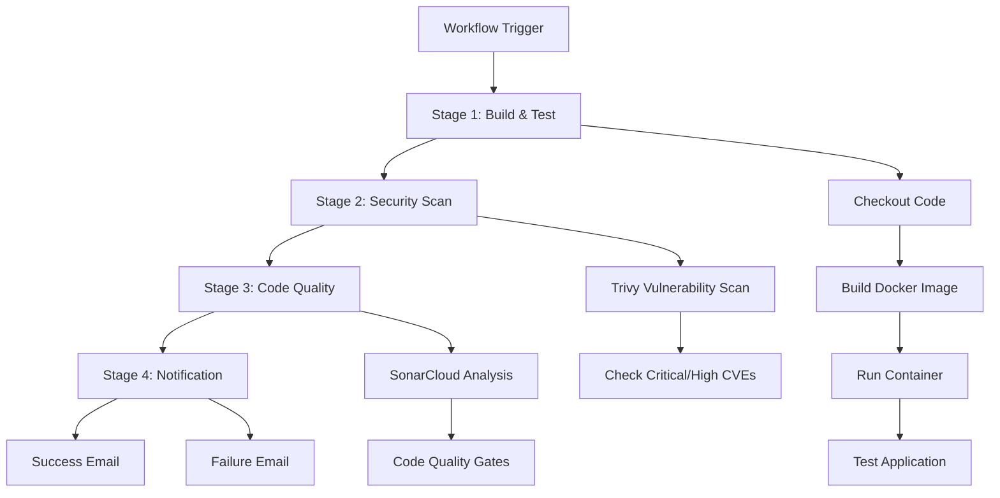

# DevSecOps CI/CD Pipeline

A comprehensive DevSecOps CI/CD pipeline implemented using GitHub Actions that integrates security scanning, code quality analysis, and automated notifications for a Django application.

## 🚀 Pipeline Overview

This pipeline implements a complete DevSecOps workflow with the following stages:

1. **Build & Test** - Docker image creation and application testing
2. **Security Scanning** - Vulnerability assessment using Trivy
3. **Code Quality** - Static code analysis with SonarCloud
4. **Notification** - Email alerts for pipeline status

## 🏗️ Pipeline Architecture



## 📋 Pipeline Stages

### Stage 1: Build Docker Image
- **Purpose**: Build and test the Django application
- **Actions**:
  - Checkout repository code
  - Build Docker image from `./mynotes` directory
  - Run container on port 80
  - Perform basic application health check

### Stage 2: Trivy Security Scan
- **Purpose**: Identify security vulnerabilities in the Docker image
- **Scanner**: [Aqua Security Trivy](https://github.com/aquasecurity/trivy)
- **Scope**: OS packages and application libraries
- **Severity Levels**: Critical and High vulnerabilities
- **Action**: Pipeline fails if critical/high vulnerabilities are found

### Stage 3: SonarQube Analysis
- **Purpose**: Static code analysis and quality assessment
- **Platform**: SonarCloud
- **Analysis**: Code smells, bugs, security hotspots, coverage
- **Requirements**: Node.js 18 for analysis

### Stage 4: Notification
- **Purpose**: Automated email notifications
- **Triggers**: Success or failure of pipeline
- **Method**: SMTP via Gmail
- **Recipients**: Development team

## 🛠️ Prerequisites

### Repository Setup
- Django application in `./mynotes` directory
- Dockerfile configured for the application
- SonarCloud project configured

### Required Secrets
Configure the following secrets in your GitHub repository:

| Secret Name | Description | Example |
|------------|-------------|---------|
| `SONAR_TOKEN` | SonarCloud authentication token | `sqp_...` |
| `MAIL_USERNAME` | Gmail username for notifications | `your-email@gmail.com` |
| `EMAIL_PASSWORD` | Gmail app password | `your-app-password` |

### GitHub Token
The pipeline uses the built-in `GITHUB_TOKEN` for SonarCloud integration.

## 🚀 Usage

### Manual Trigger
The pipeline is configured with `workflow_dispatch` trigger, allowing manual execution:

1. Navigate to **Actions** tab in your GitHub repository
2. Select **DevSecOps CI Pipeline**
3. Click **Run workflow**
4. Choose the branch and click **Run workflow**

### Adding Automatic Triggers
To enable automatic triggers, add the following to the workflow file:

```yaml
on:
  push:
    branches: [ main, develop ]
  pull_request:
    branches: [ main ]
  workflow_dispatch:
```

## 📊 Security Features

### Vulnerability Scanning
- **Tool**: Trivy by Aqua Security
- **Coverage**: OS and library vulnerabilities
- **Action**: Fails pipeline on Critical/High severity findings
- **Output**: Detailed vulnerability table

### Code Quality Gates
- **Platform**: SonarCloud
- **Metrics**: Code coverage, duplications, maintainability
- **Security**: Security hotspots and vulnerability detection
- **Integration**: PR analysis and quality gate enforcement

## 📧 Notification System

The pipeline includes comprehensive email notifications:

### Success Notifications
- Sent when all stages complete successfully
- Includes workflow completion confirmation
- Links to GitHub Actions for detailed logs

### Failure Notifications
- Triggered on any stage failure
- Immediate alert to development team
- Includes failure details and troubleshooting links

## 🔧 Configuration

### Docker Application Structure
```
project-root/
├── mynotes/
│   ├── Dockerfile
│   ├── requirements.txt
│   └── [Django application files]
├── .github/
│   └── workflows/
│       └── devsecops-pipeline.yml
└── README.md
```

### SonarCloud Configuration
Create a `sonar-project.properties` file in your repository root:

```properties
sonar.projectKey=your-project-key
sonar.organization=your-organization
sonar.sources=.
sonar.exclusions=**/node_modules/**,**/venv/**
```

## 🛡️ Security Best Practices

1. **Secret Management**: All sensitive data stored in GitHub Secrets
2. **Vulnerability Scanning**: Automated security assessment on every build
3. **Code Quality**: Continuous code quality monitoring
4. **Fail-Fast**: Pipeline fails immediately on security issues
5. **Notifications**: Real-time alerts for security and quality issues

## 📈 Monitoring & Reporting

### Pipeline Status
- GitHub Actions dashboard provides real-time pipeline status
- Email notifications ensure immediate awareness of issues
- SonarCloud dashboard for code quality trends

### Security Reports
- Trivy generates detailed vulnerability reports
- SonarCloud provides security hotspot analysis
- Historical trend analysis available through both platforms

## 🤝 Contributing

1. Fork the repository
2. Create a feature branch (`git checkout -b feature/improvement`)
3. Make your changes
4. Ensure all pipeline stages pass
5. Submit a pull request

## 📝 License

This project is licensed under the MIT License - see the [LICENSE](LICENSE) file for details.

## 🆘 Support

For issues and questions:
- Create an issue in this repository
- Check GitHub Actions logs for detailed error messages
- Review SonarCloud reports for code quality issues
- Verify Trivy scan results for security vulnerabilities

## 🔍 Additional Resources

- [GitHub Actions Documentation](https://docs.github.com/en/actions)
- [Trivy Scanner](https://github.com/aquasecurity/trivy)
- [SonarCloud Documentation](https://sonarcloud.io/documentation)
- [DevSecOps Best Practices](https://owasp.org/www-project-devsecops-guideline/)

---

